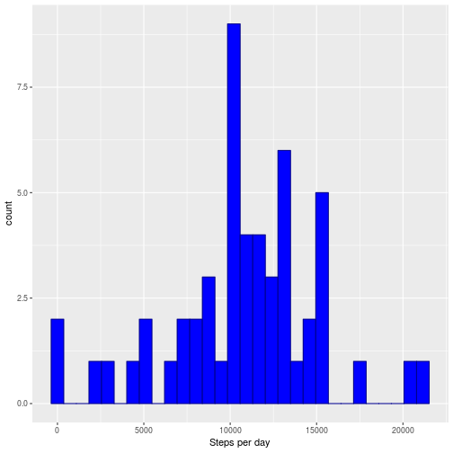

## Loading and preprocessing the data
We first read in the data from `activity.csv` within `activity.zip`. We also load the packages we will need later on.

```r
data <- read.csv(unz("activity.zip", "activity.csv"), stringsAsFactors = FALSE)
attach(data)

library(ggplot2)
```


## What is the mean total number of steps taken per day?

To calculate this, we first create a vector that holds the total number of steps per day.


```r
steps_by_day <- c()
for (i in 1:length(unique(date))){
  steps_by_day[i] <- sum(data[date==(unique(date))[i],"steps"])
}
```

Here is a histogram of the total steps per day. 


```r
qplot(steps_by_day, geom="histogram", xlab="Steps per day", col=I("dark blue"), fill=I("blue"))
```



From the histogram, the median number of steps per day is around 10000, and the data is roughly symmetrical.

We can ignore missing values and calculate the mean and median:


```r
mean_steps <- mean(steps_by_day, na.rm=TRUE)
median_steps <- median(steps_by_day, na.rm = TRUE)
```

The mean total number of steps taken per day is 10766.19 (to two decimal places). The median total number of steps taken per day is 10765.


## What is the average daily activity pattern?

A good way to break down the activity pattern over a day is by the average number of steps walked in each 5-minute interval.


```r
intervals<-unique(interval)
mean_interval <- c()

for (i in 1:length(intervals)){
  mean_interval[i] <- mean(data[interval==intervals[i], "steps"], na.rm=TRUE)
}

by_interval<-data.frame(intervals, mean_interval)
```

Here is a time series plot of the average number of steps taken per 5-minute interval throughout the day.


```r
ggplot(by_interval, aes(intervals, mean_interval)) + geom_line() + xlab("Interval") + ylab("Mean number of steps")
```


```r
max_steps <- by_interval[mean_interval==max(mean_interval), 1]
```

The 5-minute interval beginning at 835 contains the maximum number of steps on average.


## Imputing missing values


```r
missing <- sum(is.na(data))
```

There are 2304 missing values in this dataset.

One way of filling in these missing values is to use the mean number of steps for each 5-minute interval. Here is a new dataset, with missing values filled in using this method.


```r
new_data <- data

for (i in 1:nrow(new_data)){
  if (is.na(new_data[i,"steps"])){
    new_data[i, "steps"] <- by_interval[intervals==new_data[i,3], "mean_interval"]
  }
}
```

Here is another histogram of the daily activity pattern after imputing the missing data, and the new mean and median number of steps taken per day.


```r
# Finding new mean and median steps per day
new_steps_by_day <- c()
for (i in 1:length(unique(date))){
  new_steps_by_day[i] <- sum(new_data[date==(unique(date))[i],"steps"])
}

new_mean_steps <- mean(new_steps_by_day)
new_median_steps <- median(new_steps_by_day)

# Histogram
qplot(new_steps_by_day, geom="histogram", xlab="Steps per day", col=I("dark blue"), fill=I("blue"))
```


With missing data filled in, the mean number of steps per day is 10766.19 and the median is 10766.19.


## Are there differences in activity patterns between weekdays and weekends?

We first add a new factor variable to the dataset, with two levels "weekday" and "weekend".


```r
new_data$weekday <- factor(new_data$date, levels=c("weekday", "weekend"))
new_data$weekday <- ifelse(weekdays(as.Date(new_data$date)) %in% c("Monday", "Tuesday", "Wednesday", "Thursday", "Friday"), "weekday", "weekend")

interval_by_weekday<-aggregate(steps~weekday+interval, new_data, mean)
```

Here are time series plots of daily activity patterns by weekday/weekend.


```r
ggplot(interval_by_weekday, aes(interval, steps)) + geom_line() + facet_wrap(~weekday)
```


From the two time series plots, the subject walked more (and earlier) on weekday mornings, with another smaller spike in activity on weekday evenings. On weekends the subject had a later start to the day's activity, but showed a slightly higher and more consistent number of steps throughout the day.
